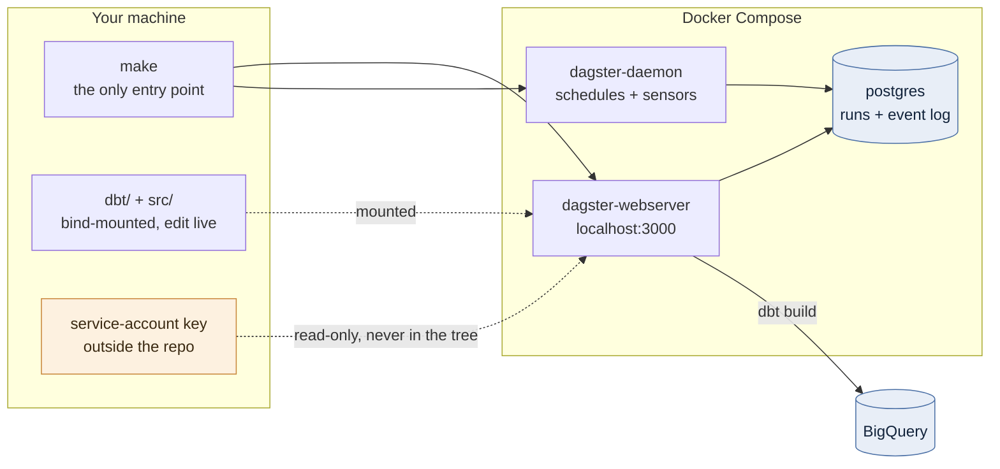
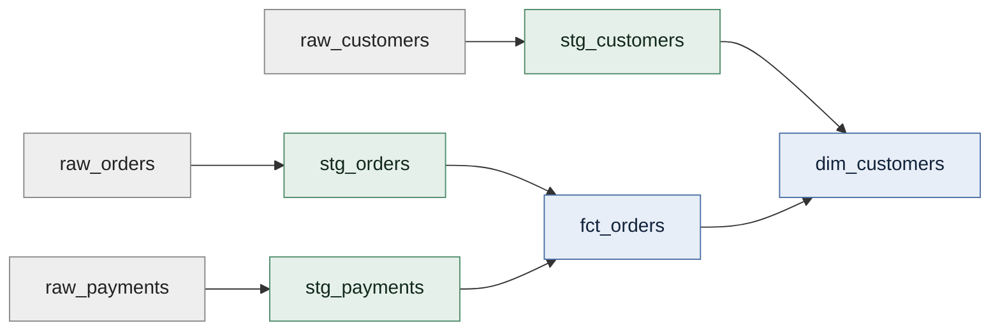
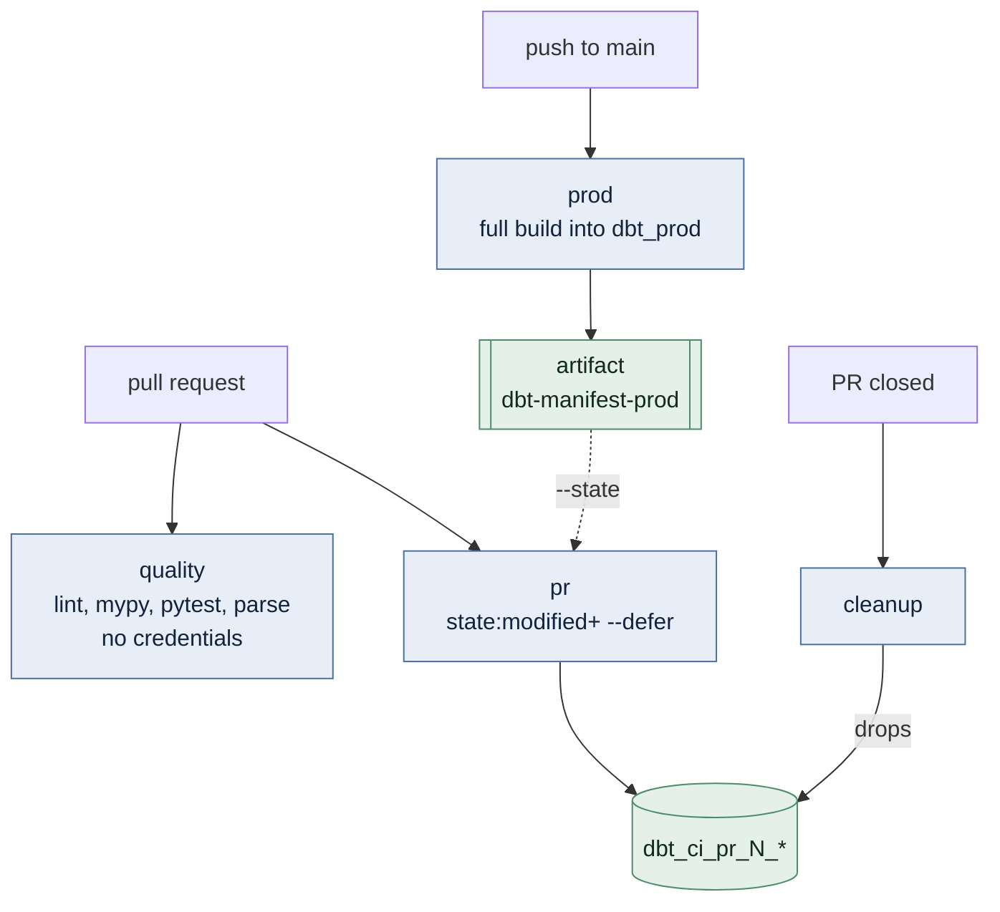

# dagster_dbt_bq

[](https://github.com/vividity/dagster_dbt_bq/actions/workflows/ci.yml)

**Dagster-orchestrated dbt transformations on Google BigQuery — every process in Docker, with keyless Slim CI.**

dbt models become Dagster assets automatically, and dbt tests become Dagster asset
checks. There is no per-model Python to maintain: adding a `.sql` file adds an asset.

---

## Architecture



There is **no host virtualenv and none should be created** — `dagster-dbt` requires
Python `<3.14`, so the image pins 3.12 and every `make` target shells into it.

## Data flow

`seeds → staging → marts`, all generated from the dbt DAG:



Seeds are **scaffolding** — the three jaffle_shop CSVs exist so the whole
Docker → credentials → BigQuery chain is verifiable on a fresh clone. Delete them
when real sources arrive.

## Quick start

```bash
cp .env.example .env    # set GCP_PROJECT

make build              # build the image; also validates that the dbt project parses
make dbt-deps           # populate dbt/dbt_packages
make up                 # webserver on http://localhost:3000, plus the daemon
make seed && make dbt-build
```

`make help` lists every target.

| Target | Does |
| --- | --- |
| `build` / `up` / `down` | image, then start or stop the stack |
| `dbt-build` / `seed` / `dbt-test` | run models + tests / load seeds / tests only |
| `dbt ARGS="..."` | any dbt subcommand, e.g. `make dbt ARGS="build --select stg_orders+"` |
| `dbt-parse` | parse the project — no warehouse connection needed |
| `defs` | list the Dagster assets resolved from the dbt manifest |
| `test` / `lint` | ruff + mypy + pytest / autofix |
| `logs` / `shell` / `clean` | follow logs / shell in the image / drop volumes and artefacts |

## Slim CI

A pull request builds only what it changed **plus everything downstream**, deferring
unchanged refs to the manifest published by the last successful `main` build.



Measured on this project: changing one staging model builds **15 nodes instead of
24**, and the untouched models resolve against `dbt_prod` rather than being rebuilt.

**Auth is keyless.** Workload Identity Federation exchanges GitHub's OIDC token for
short-lived GCP credentials, so the repository holds **no secrets at all** — only the
`WIF_PROVIDER` and `WIF_SERVICE_ACCOUNT` variables. The provider is pinned with the
attribute condition `assertion.repository == 'vividity/dagster_dbt_bq'`; without it
any repository on GitHub could mint tokens for the service account.

## Where the data lands

`dataset` is the base name; each layer appends its own suffix.

| Environment | Base | Produces |
| --- | --- | --- |
| local (`dev` target) | `dbt_dev` | `dbt_dev`, `dbt_dev_staging`, `dbt_dev_marts` |
| `main` CI (`ci` target) | `dbt_prod` | `dbt_prod`, `dbt_prod_staging`, `dbt_prod_marts` |
| pull request (`ci` target) | `dbt_ci_pr_<n>` | dropped automatically when the PR closes |

Two profile targets exist because WIF issues an *external account* credential that
`method: service-account` cannot read: `dev` uses the mounted keyfile, `ci` uses
`oauth-secrets` with a bare access token.

## Layout

| Path | What it is |
| --- | --- |
| `src/dagster_dbt_bq/defs/` | Dagster definitions, loaded by `load_from_defs_folder` |
| `src/dagster_dbt_bq/defs/dbt/defs.yaml` | `DbtProjectComponent` — the whole dbt ↔ Dagster wiring |
| `dbt/` | dbt project `bq_analytics` — models, seeds, profile |
| `docker-compose.yml` / `Dockerfile` | postgres + webserver + daemon |
| `.github/workflows/ci.yml` | quality, prod, pr, cleanup |

## Versions are load-bearing

| Pin | Why |
| --- | --- |
| `dbt-core` 1.11.14, `dbt-bigquery` 1.11.3 | `dagster-dbt` 0.29.19 requires `dbt-core<1.12` |
| Python 3.12 | `dagster-dbt` does not support 3.14 |
| `dagster*` 1.13.19 / 0.29.19 | the Dagster libraries must move together |

See [`CLAUDE.md`](CLAUDE.md) for conventions, the auth contract, and the gotchas
worth knowing before changing anything.
